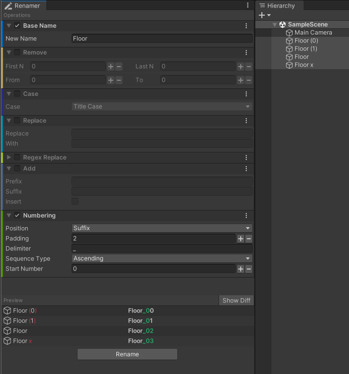
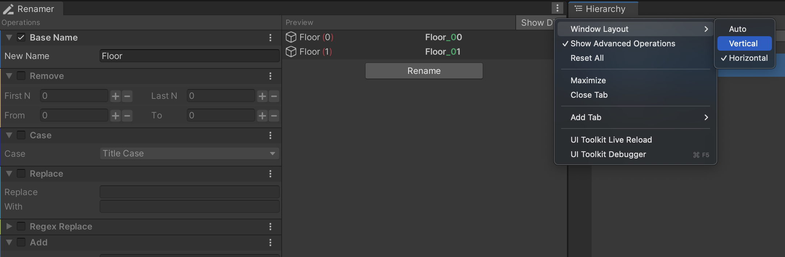

# Renamer

This Unity package provides bulk renaming functionality for GameObjects in the scene view and assets in the project view.

## Features
- 7 operations
  - Replace base name
  - Remove N characters from start, end or the middle
  - Change case to upper, lower or title
  - Search and replace a substring
  - Regex search and replace
  - Add a prefix or suffix or insert text at a specific index
  - Number a sequence with padding
- The window supports horizontal and vertical layouts, including auto-layout based on the window size.
- Rename operations are grouped into basic and advanced categories. Select the mode via the window burger menu.

## Support
Unity 2021.3 or newer.